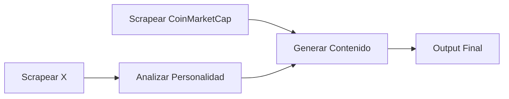

# Crypto News Replicator 🚀

Proyecto completo para extraer noticias de CoinMarketCap y replicarlas con el estilo de escritura personalizado del perfil de X @zuler.

## Características Principales

- 🐦 **Scraping de X**: Extrae tweets sin usar API oficial
- 🧠 **Análisis de Personalidad**: Analiza estilo, vocabulario, tono y patrones
- 📰 **Scraping de CoinMarketCap**: Extrae noticias TOP de las principales criptomonedas
- ✨ **Generación con IA**: Replica contenido con modelos avanzados (Gemini, Claude, GPT-4)
- 🖼️ **Procesamiento de Imágenes**: Modifica imágenes con filtros y marca de agua
- 💻 **Interfaz Web**: Frontend moderno con Next.js listo para Vercel

## Estructura del Proyecto

```
crypto-news-replicator/
├── frontend/                    # Aplicación Next.js
│   ├── app/
│   │   ├── api/                # API routes (conectan con Python)
│   │   │   ├── scrape-x/
│   │   │   ├── analyze/
│   │   │   ├── scrape-cmc/
│   │   │   ├── generate/
│   │   │   └── run-all/
│   │   ├── layout.tsx
│   │   ├── page.tsx
│   │   └── globals.css
│   ├── components/             # Componentes React
│   ├── lib/                    # Utilidades
│   └── public/
├── scrapers/                   # Scripts de web scraping
│   ├── x_scraper.py           # Scraper de X/Twitter
│   └── coinmarketcap_scraper.py
├── utils/                      # Utilidades Python
│   ├── personality_analyzer.py
│   ├── style_replicator.py    # Generación con IA
│   └── image_processor.py
├── data/                       # Datos recolectados (no en Git)
│   ├── x_tweets/
│   ├── coinmarketcap/
│   └── processed/
├── models/                     # Análisis de personalidad
│   └── training_data/
├── output/                     # Contenido generado
├── images/                     # Imágenes procesadas
├── config/                     # Configuraciones
├── main.py                     # Script principal CLI
├── requirements.txt            # Dependencias Python
├── .env.example                # Template de variables
└── README.md
```

## Tecnologías Utilizadas

### Backend
- **Python 3.8+**
- Playwright (web scraping)
- BeautifulSoup4 (parsing HTML)
- Google Generative AI (Gemini)
- Anthropic Claude API
- OpenAI GPT API
- Pillow (procesamiento de imágenes)

### Frontend
- **Next.js 14** (App Router)
- **React 18**
- **TypeScript**
- **Tailwind CSS**
- Axios (HTTP requests)

### Deploy
- **Vercel** (hosting frontend)
- **GitHub** (version control)

## Pipeline del Proyecto



1. **Scrapear tweets de @zuler**: Sin usar API, con Playwright
2. **Analizar personalidad**: Patrones, vocabulario, tono, estructura
3. **Scrapear CoinMarketCap**: Noticias TOP de monedas principales
4. **Generar contenido**: Usar IA para replicar el estilo

## Demo en Vivo

🔗 [Ver Demo](https://crypto-news-replicator.vercel.app) (próximamente)

## Instalación Rápida

### Backend (Python)

```bash
# Clonar el repositorio
git clone https://github.com/carlos-israelj/Crypto-News-Replicator.git
cd Crypto-News-Replicator

# Instalar dependencias de Python
pip install -r requirements.txt
playwright install chromium

# Configurar variables de entorno
cp .env.example .env
nano .env  # Agrega tu GOOGLE_API_KEY o ANTHROPIC_API_KEY
```

### Frontend (Next.js)

```bash
cd frontend
npm install

# Configurar variables de entorno
cp .env.local.example .env.local
nano .env.local  # Agrega tu API key
```

## Uso

### Opción 1: Interfaz Web (Recomendado)

```bash
cd frontend
npm run dev
```

Abre [http://localhost:3000](http://localhost:3000) y usa la interfaz visual para:
- Configurar cada paso
- Ejecutar scraping
- Ver resultados en tiempo real
- Generar contenido con un clic

### Opción 2: Línea de Comandos

```bash
# Pipeline completo
python main.py

# Paso individual
python main.py --step 1  # Scrapear X
python main.py --step 2  # Analizar personalidad
python main.py --step 3  # Scrapear CoinMarketCap
python main.py --step 4  # Generar contenido
```

## Deploy en Vercel

### Preparar el proyecto

1. Asegúrate de que todos los cambios estén en Git:

```bash
git add .
git commit -m "Initial commit"
git push origin main
```

2. Ve a [Vercel](https://vercel.com) y conecta tu repositorio de GitHub

3. Configura las variables de entorno en Vercel:
   - `GOOGLE_API_KEY`: Tu API key de Gemini
   - O `ANTHROPIC_API_KEY` si prefieres Claude

4. Deploy automático

### Variables de Entorno Necesarias

```bash
# Requerido (elige uno)
GOOGLE_API_KEY=tu_api_key_aqui
# O
ANTHROPIC_API_KEY=tu_api_key_aqui
# O
OPENAI_API_KEY=tu_api_key_aqui

# Opcional
MODEL_PROVIDER=google  # o 'anthropic' o 'openai'
MODEL_TEMPERATURE=0.7
```

## Configuración

### Modelos de IA Soportados

#### Google Gemini (Recomendado - Gratis)
- Modelo: `gemini-1.5-flash`
- Velocidad: Rápido
- Costo: Gratis hasta 1500 requests/día
- Obtener API key: [Google AI Studio](https://makersuite.google.com/app/apikey)

#### Anthropic Claude
- Modelo: `claude-3-5-sonnet-20241022`
- Velocidad: Medio
- Costo: ~$3 por 1M tokens
- Obtener API key: [Anthropic Console](https://console.anthropic.com)

#### OpenAI GPT-4
- Modelo: `gpt-4-turbo-preview`
- Velocidad: Medio
- Costo: ~$10 por 1M tokens
- Obtener API key: [OpenAI Platform](https://platform.openai.com)

### Personalizar Monedas

Edita `scrapers/coinmarketcap_scraper.py`:

```python
COINS = [
    'bitcoin',
    'ethereum',
    'solana',
    # Agrega más...
]
```

## Troubleshooting

### Error: "API key not found"
- Asegúrate de tener un archivo `.env` con tu API key
- Verifica que la variable tenga el nombre correcto (`GOOGLE_API_KEY`, etc.)

### Error en scraping de X
- X puede haber cambiado su estructura HTML
- Intenta aumentar `X_SCROLL_COUNT` en `.env`
- Como alternativa, usa `--skip-scraping` y proporciona tus propios datos

### Frontend no se conecta al backend
- Verifica que los paths relativos en `lib/python-executor.ts` sean correctos
- Asegúrate de que Python 3 esté instalado y en el PATH

## Seguridad

⚠️ **NUNCA compartas tus API keys públicamente**

- Agrega `.env` al `.gitignore` (ya incluido)
- Usa variables de entorno en Vercel, no las pongas en el código
- Revoca y regenera cualquier API key expuesta accidentalmente

## Contribuir

Las contribuciones son bienvenidas. Por favor:

1. Fork el proyecto
2. Crea una rama para tu feature (`git checkout -b feature/AmazingFeature`)
3. Commit tus cambios (`git commit -m 'Add some AmazingFeature'`)
4. Push a la rama (`git push origin feature/AmazingFeature`)
5. Abre un Pull Request

## Licencia

MIT

## Contacto

Carlos Israel Jiménez - [@carlos-israelj](https://github.com/carlos-israelj)

Proyecto: [https://github.com/carlos-israelj/Crypto-News-Replicator](https://github.com/carlos-israelj/Crypto-News-Replicator)
